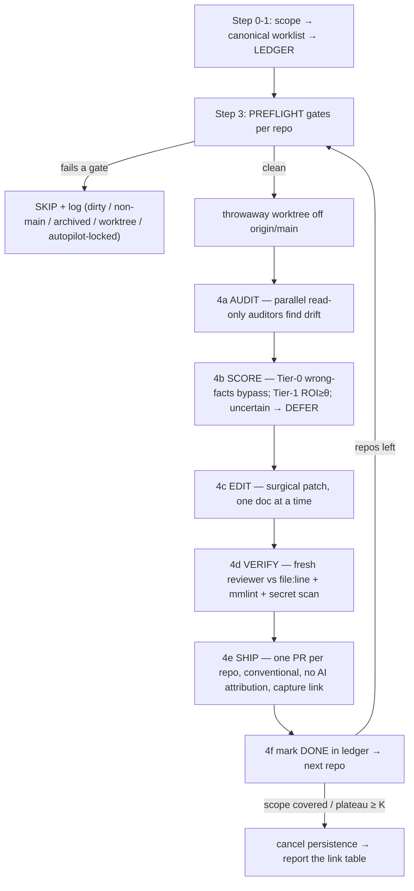

# /docs-loop — bring every repo's docs up to date, one repo at a time, safely

You give it a scope; it (1) turns that scope into a **canonical, ordered repo worklist** and freezes it into
a central **ledger** (so the loop resumes across compaction, never restarts), (2) for **each repo in turn**
runs a bounded **audit → score → edit → verify → ship** cycle that makes only the doc edits it can *prove*
against current code, and (3) opens **one PR per repo**, captures the link, marks the repo done, and advances
— stopping when the scope is covered or the docs are already fresh. The whole thing is built to be **safe and
sound**: it treats the naive "let an agent rewrite every README" idea as the hazard it is and gates every
repo behind a preflight contract before a single byte is written.

The mantra is the same as the other loops: **the boulder never stops** — but here it stops *cleanly* the
moment a repo has no verified drift left, and it would rather **leave a doc alone than invent a word**.

## What it is NOT

- **NOT** a rewriter. "Up to date" does **not** mean "reworded" — it means **no remaining claim that the
  code contradicts**. Absent a detected drift signal, the correct action is to *leave the doc alone*.
- **NOT** a doc generator. It does not author new narrative/marketing/positioning prose, and it never
  regenerates a whole file — it **patches** the specific stale claim, preserving the existing voice.
- **NOT** allowed to touch hand-authored or historical files (CLAUDE.md, ADRs, worklogs, GOAL/DEFERRED,
  design/research docs) — see the OFF-LIMITS denylist.
- **NOT** an autonomous merger. It opens PRs; a human merges. It never pushes to `main`, never force-pushes,
  never `--no-verify`.
- **NOT** a code changer. Docs-only. If the code is wrong, it defers — it does not "fix" code to match a doc.

## The shape (read this once)

An **outer loop over a repo list** (memory in a central ledger) wrapping a **refine-loop-style inner cycle**
per repo. Auditors fan out (subagents read); editing is serial in the main thread (you synthesize + write).

## Step 0 — parse args (scope + the depth dial)

- A **`theta=N`** token sets the per-edit ROI threshold (default **`theta=2.0`**) — the dial for how
  aggressively to touch docs. High θ = only fix docs that are clearly, confidently stale; low θ = also
  polish thin/awkward sections. θ is the human's dial. Strip it from the args.
- Everything else is the **scope**: explicit repo names ("agent-tap, neutral-code"), a workspace phrase
  ("all active neutral", "all of neutral"), a path, or **empty → the current repo only**. This is the
  outer-loop domain.

## Step 1 — build the CANONICAL worklist → write the LEDGER

**Never enumerate with `ls`.** A raw listing of `~/repos/neutral/` is ~127 dirs — most are **worktrees**
(`*-wt*`, `*.wt-*`, `wt-*`) and duplicate checkouts, not repos. Build the list deliberately:

1. **Resolve names → canonical checkouts.** For a neutral scope, read the **Repo Map in
   `~/repos/neutral/CLAUDE.md`** at runtime for the authoritative repo↔status list (do **not** hardcode it —
   it drifts; and never copy its credential-bearing content anywhere). Map each repo to its single canonical
   checkout (`~/repos/neutral/<repo>`).
2. **Collapse worktrees.** A dir whose `git rev-parse --git-common-dir` points *outside itself* is a
   worktree — fold it into its canonical repo; never treat 8 `neutral-shell.wt-*` dirs as 8 repos.
3. **Classify + filter.** Include **Active** repos by default. **Exclude ARCHIVED** repos
   (`gh repo view <org>/<repo> --json isArchived` → true, e.g. `neutral-k8s` whose pushes 403 — its changes
   go to its live sibling) and **Reference/personal** repos (e.g. `Alex-Boone`) unless the scope explicitly
   names them. A repo with no local clone → record `BLOCKED (not cloned)`, don't drop it silently.
4. **Order by blast radius:** Active + most-recently-churned first (docs read most, drift bites hardest),
   quieter Active next, Design/Research last.

Freeze the result into the **ledger BEFORE touching any repo** — the ledger is the outer loop's memory *and*
its stop signal. Copy `templates/DOCS-LOOP-LEDGER.md`, fill `{{SCOPE}}`/`{{THETA}}`/`{{DATE}}` and one row
per repo (status `PENDING`). If a ledger already exists, **do not rebuild it** — append newly-in-scope repos
as `PENDING`, keep existing statuses (append-only).

## Step 2 — recover state (resume the outer loop, never restart)

Read, if present: the **ledger** (which repos are done + the plateau counter), the **bottom** of
`DOCS-LOOP-WORKLOG.md` (what shipped last), and `DOCS-LOOP-DEFERRED.md` (open human-only calls). These files
survive context loss; resume from them. **The next repo = the first ledger row not in {DONE, DEFERRED,
SKIPPED}.** Never re-audit a DONE repo — the `Status` column is the idempotent unread-tracker.

**Where central state lives** (this loop spans repos, so its bookkeeping is central — only the finished doc
edits go into each repo): `~/repos/neutral/.docs-loop/` for a neutral scope, else the scratchpad run dir.
Three files: `DOCS-LOOP-LEDGER.md`, append-only `DOCS-LOOP-WORKLOG.md` (newest at bottom, evidence on every
done), `DOCS-LOOP-DEFERRED.md`.

## Step 2.5 — engage persistence, mandatory clean exit

- If OMC is available, invoke the **`ralph`** skill with the goal "bring docs up to date across `{{SCOPE}}`,
  one repo at a time per the ledger." The stop state is the ledger's counters, checked against the FILE each
  turn — **not a feeling**.
- **Clean exit is mandatory:** on completion or a real blocker, run **`/oh-my-claudecode:cancel`** and clear
  any persistence flag. A dangling persistence state re-fires the Stop hook forever.

## Step 3 — PREFLIGHT GATES (the safety contract — run per repo, before ANY write)

This is the whole product. A doc loop's blast radius (a leaked token, a clobbered feature branch, a
confidently-wrong public README) dwarfs the value of a fresh doc, so these gates are **hard skip-on-fail
checks, not warnings.** Full detail + the exact commands are in **[references/safety-contract.md](references/safety-contract.md)** —
read it before the first repo. The nine gates, in one breath:

1. **Canonical worklist** (Step 1) — never `ls`; collapse worktrees; denylist archived repos.
2. **Work in a throwaway `origin/main` worktree — NEVER the live checkout.** `git fetch origin`, then
   `git worktree add --detach <tmp> origin/main`. This sidesteps the dirty-tree / feature-branch /
   active-autopilot-race problem *by construction* (many neutral checkouts carry dozens of uncommitted files
   on feature branches). Read code truth and make edits **there**; remove the worktree when done. Never
   `git stash`, `checkout`, or `add -A` in the user's checkout.
3. **Secret firewall.** Never read `CLAUDE.md`, `.env*`, `.keys/`, `*.pem`, `*.p12`, or `credentials` into
   the drafting context. Scan every staged hunk for token/key/card patterns (regex + `gitleaks` if present);
   any hit **aborts that repo**. Output may contain no literal secret — docs describe *mechanism*, never
   *values*.
4. **OFF-LIMITS denylist** (never edit): `CLAUDE.md`/`AGENTS.md` (any level), `docs/adr/**`,
   anything matching `*WORKLOG*`/`*GOAL*`/`*DEFERRED*`/`*COORDINATE*`/`REFINE-*`/`DOCS-LOOP-*`,
   `CHANGELOG`, `LICENSE`, and `docs/research/**` + design/decision docs. Default is **annotate, never
   rewrite** hand-authored prose. In-scope by default: **generated/reference surfaces** — README
   install/usage, API reference, config tables, and architecture diagrams that describe *current* code.
5. **Skip an autopilot-locked repo.** A running loop / a fresh `AUTOPILOT-WORKLOG.md` heartbeat / a lockfile
   → a second loop committing there races it. Skip + log.
6. **Clean-main truth.** Generate docs against **`origin/main`** (the worktree from gate 2), not a dirty
   feature branch whose code may never ship.
7. **Scope filter is applied BEFORE drafting**, not as a preference.
8. **Branch-protection check.** If even a PR needs a review it won't get, note it — don't stall silently.
9. **Nothing outward-facing gets merged autonomously** (Step 5 defer rules).

If a repo fails a gate → set its ledger status to `SKIPPED`/`BLOCKED` with the reason, and **move on**.

## Step 4 — the inner per-repo cycle (audit → score → edit → verify → ship)

Refine-loop's DISCOVER→SCORE→EXECUTE→RECORD, specialized to docs, bounded so a repo *finishes* and the loop
advances.

**4a. AUDIT — breadth-first, PARALLEL, read-only.** Fan out one auditor subagent per doc file (batch small
docs; dense docs solo) — subagents read, you synthesize. Each auditor gets ONE doc + read access to the
repo's code and returns a **structured staleness report, never an edit**. For every claim in the doc it finds
the code truth and classifies. The detection rules + off-limits list are in
**[references/staleness-signals.md](references/staleness-signals.md)**; in short: factual drift (ports, env
vars, flags, paths, endpoints, signatures, versions, config keys), structural drift (renamed/moved modules,
Mermaid that no longer matches the tree), dead references (`git ls-files` cross-check), coverage gaps (shipped
subsystem with no doc), and the cheap `git log` age heuristic (doc older than the code it documents). Each
returns per-claim tuples: `doc:line | claim | code-truth (file:line) | verdict {MATCHES|STALE|WRONG|MISSING}
| suggested-fix | confidence`.

**4b. SCORE + RANK — you synthesize (verify flagged claims yourself before trusting an auditor).** Two-tier:
- **Tier 0 — bypasses θ:** a doc that is **factually wrong or dangerously misleading** (wrong port, a command
  that would fail/harm, a security instruction now false). Always fix — **if the fix is confidently
  verifiable.** This class has a hard floor.
- **Tier 1 — ROI-gated:** clarity, a missing diagram, a thin section. `ROI = Impact × Confidence ÷ Effort`
  on a 1–5 scale, qualifies only if `ROI ≥ θ`. **Confidence is load-bearing:** an edit whose code truth you
  cannot verify scores below θ and is **DEFERRED, never guessed.** YAGNI + Rule-of-Three reject speculative
  doc expansion — don't document hypothetical features.

Rank Tier-0 first, then Tier-1 by descending ROI. **No drift signal on a doc → leave it untouched.**

**4c. EDIT — serial, surgical, in the worktree.** One doc at a time, in the main thread (auditing fans out;
editing never does — two agents editing one repo's docs clobber). **Patch the stale claim; never regenerate
the file.** Preserve headings, structure, and the doc's existing voice. Honor the neutral doc rules: **docs
state intent, not sources** (never name people or cite calls/Slack — state the decision as "we"); Mermaid in
GitHub-bound `.md`, used where it helps. Respect a **diff-size cap** — a "doc update" that rewrites a large
fraction of a file is a red flag; stop and re-scope.

**4d. VERIFY — external, never self-report.** The definition-of-done's teeth:
- **A fresh reviewer subagent** (clean context) re-checks each changed claim against its cited `file:line`
  code anchor. Unverifiable claims are **removed, not softened**. A fix is "done" only if the value it now
  states is greppable in the code.
- **Lint every touched Mermaid diagram:** `node ~/.claude/tools/mmlint/lint.mjs <file.md>` must print `OK`
  for all blocks — a broken diagram renders as an error box on GitHub.
- **Secret scan** the staged diff (gate 3) — abort on any hit.
- **View any image** you're about to embed before shipping it.

**4e. SHIP — one PR per repo, capture the link.** From the worktree branch: conventional commit (`docs: …`),
**zero AI attribution** (no `Co-Authored-By` / "Generated with Claude"). `unset GITHUB_TOKEN GH_TOKEN` before
any github.com op. **Open a PR — never push to `main`, never force-push, never `--no-verify`.** After the PR,
`gh run watch`; red CI on a docs-only change (usually a broken diagram) → fix or revert. Capture the **PR
link** into the ledger row + worklog entry — this is the deliverable Sergio reads: *Docs → push → link,
always.* Then remove the throwaway worktree.

**4f. Mark the repo DONE.** Set the ledger row `Status → DONE`, fill `Docs touched` + `link`, append the
worklog entry (evidence: the file:line anchors, `mmlint OK n/n`, the PR link). Update `plateau_repos`:
**+1** if the repo needed zero edits above θ, **reset to 0** otherwise. Advance to the next PENDING repo.

## Step 5 — RUN THE LOOP / when to stop (the boulder never stops)

Repeat Step 3→4 for each PENDING repo. At each repo boundary, check the ledger counters against the FILE:

- **All repos DONE/DEFERRED/SKIPPED → SUCCESS.** Report the table of PR links.
- **`plateau_repos ≥ K` (default K=3) → diminishing returns.** Several consecutive repos had docs already
  fresh (nothing above θ). Report: *"Docs already current across the last K repos at θ=`{{THETA}}`; lower θ
  (e.g. to `{{THETA-0.5}}`) to polish thinner docs."* Never claim "done/perfect" — claim "no verified drift
  clears θ."
- **The repo list is finite** — it *is* the budget ceiling (no open-ended round count).
- **BLOCKED is reported distinctly from SUCCESS** — an archived/403/CI-red repo is BLOCKED, not dressed as
  done.

**Defer a single doc to Sergio** (park in `DOCS-LOOP-DEFERRED.md`: Context / Default-taken / To-change; in a
neutral repo, **try `/alex-research!` first** to settle intent) when the change needs judgment the code can't
give: a **roadmap/strategy/positioning** call (what we *intend*, not what the code *is*), an **ambiguous**
stale section where you'd be guessing, a **product decision** (deprecate/rename a public thing),
**licensing/legal/security-posture** wording, deleting a doc, or **anything that would name a person or cite
a call**. Ship the confident edits, note the deferred doc, still mark the repo DONE — set the row `DEFERRED`
only if the *whole* repo is blocked on it.

**Clean exit (mandatory):** on any halt, run `/oh-my-claudecode:cancel`, clear persistence, and report —
per repo: what shipped (PR link + evidence), what was deferred, what was skipped and why, and the θ to lower
to go deeper.

## Rules

- **Safe before fresh.** A stale doc is cheaper than a confident lie or a leaked key. Every gate in Step 3 is
  a hard skip-on-fail — if you can't satisfy it, skip the repo and log it. Never work around a gate.
- **Never the live checkout.** Always a throwaway `origin/main` worktree; never stash/checkout/`add -A` in
  the user's tree; stage only the exact doc files you wrote, by path.
- **Verify or delete.** Every doc claim cites a `file:line` that proves it, re-checked by a fresh reviewer;
  unverifiable text is removed, never reworded to sound safer. No claim ships on the model's *memory* of what
  the code "probably" does.
- **Patch, never regenerate.** Preserve voice and structure; a whole-file rewrite is forbidden.
- **Hands off history + secrets.** The OFF-LIMITS denylist (CLAUDE.md, ADRs, worklogs, GOAL/DEFERRED,
  research/design docs) is never edited; secret-bearing files are never even read into context; output
  carries no literal token/key/card.
- **PR-only, no AI attribution, keep CI green.** Conventional `docs:` commits; `unset GITHUB_TOKEN GH_TOKEN`;
  `gh run watch`; never force-push / `--no-verify` / direct-to-main; never change global git config.
- **Docs state intent, not sources** — never name people or cite calls/Slack; state the decision as "we".
  Easy to read, build from the familiar; Mermaid where it helps and **always `mmlint`-clean**.
- **Bounded done.** "Up to date" = no remaining contradicted claim, not "rewritten." No drift → leave it
  alone. Halt on scope-covered or `plateau_repos ≥ K`; report the θ to lower, don't loop forever.
- **Defer, don't ask.** Go uninterrupted; for a would-be question try `/alex-research!` (or `/research!`)
  first, else pick the reversible default (annotate not rewrite; draft PR not merge), park it in
  `DOCS-LOOP-DEFERRED.md`, and keep moving. Surface to Sergio ONLY a roadblock that blocks all progress.
- **The boulder never stops** — but it stops *cleanly* when a repo has no verified drift left; don't invent
  work to keep it running.

## Templates & references

- **[references/safety-contract.md](references/safety-contract.md)** — the nine preflight gates in full, with
  the exact preflight commands (worktree collapse, clean-main check, secret scan, archived-repo check,
  autopilot-lock detection). Read before the first repo.
- **[references/staleness-signals.md](references/staleness-signals.md)** — the drift-detection rules the
  auditors apply + the OFF-LIMITS denylist + the auditor's per-claim return shape.
- **[templates/DOCS-LOOP-LEDGER.md](templates/DOCS-LOOP-LEDGER.md)** — the central repo tracker; `Status`
  column is the idempotent resume tracker; holds `plateau_repos` + `θ`.
- **[templates/DOCS-LOOP-WORKLOG.md](templates/DOCS-LOOP-WORKLOG.md)** — append-only, newest at bottom, one
  evidence-bearing entry per completed repo with the PR link.
- **[templates/DOCS-LOOP-DEFERRED.md](templates/DOCS-LOOP-DEFERRED.md)** — per-doc human-only calls
  (Context / Default-taken / To-change).

Fill every `{{PLACEHOLDER}}` — leave none literal (`{{DATE}}`=`date +%F`, `{{SCOPE}}`=the parsed scope,
`{{THETA}}`=the θ dial, `{{REPO}}`=repo name, `{{N}}`=repo count).

> **Invocation note:** this skill is `disable-model-invocation: true` on purpose — a loop that commits across
> many repos should fire only when you type `/docs-loop`, never auto-trigger mid-conversation. Flip that flag
> off if you ever want the description keywords to auto-invoke it.
